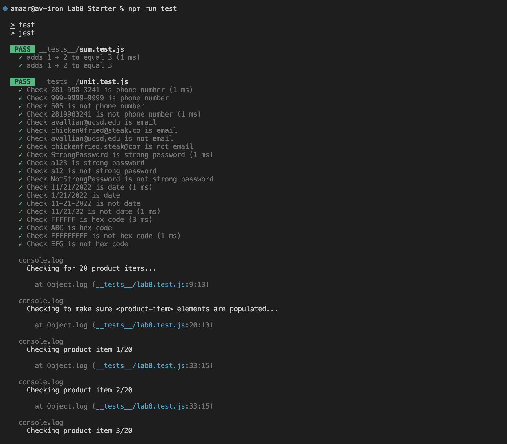

# Lab 8 - Starter
## Amaar Valliani

1. Within a GitHub Action that runs whenever the code is pushed because that way when someone pushes a new feature, you can test the code to make sure nothing is broken and this will happen automatically throught GitHub Actions when you push.
2. No
3. No because the message feature will have many other features it interacts with and has many moving parts for it to work so it would be more suitible to use an e2e test for the feature rather than a unit test
4. Yes because this feature is does not depend on other features or functions and should be confined to a few or one function so it will be easy to test it using unit tests